# Plainbook

**A free trading journal that lives on your machine, for forex, futures,
stocks, crypto and prop firm traders.** Your trades are markdown files and
screenshots in a folder you own: no account, no cloud, no subscription. Log
every trade with its idea and its charts, measure it in R with its MFE and
MAE, hold a prop account against the rules of its firm (daily loss limit,
max drawdown, profit target, trading days), and read your edge in the
statistics and in monthly and quarterly reports. It runs on Windows, macOS
and Linux, and it is built to be kept by a coding agent.

[](https://github.com/stop-loss-enjoyer/plainbook/actions/workflows/tests.yml)
[](https://github.com/stop-loss-enjoyer/plainbook/releases/latest)
[](LICENSE)
[](https://www.python.org/)
[](#built-to-be-kept-by-an-agent)

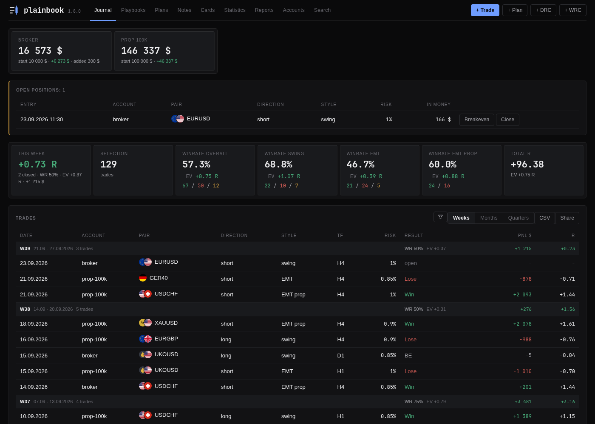

<p align="center"><i>Every screenshot on this page is made on an invented journal.</i></p>

The front page is the journal itself: the balance of every account, the
positions in the market right now, the figures of the current week, and every
trade grouped by week, month or quarter. A trade is written in two steps, the
idea before the market answers and the result after, and everything the
journal shows is worked out from those records on every look: balances, R,
winrates, the cost of every rule you broke.

**R** is the unit most figures are in. It is the result of a trade measured
against the risk taken on it: a trade that risked 1% of the account and made
2% is +2 R, one that hit its stop is about -1 R. It makes trades on a 10 000
account and on a 100 000 account comparable, which is why the journal counts
in R wherever it can.

Contents: [Why](#why-a-journal-on-your-own-machine) ·
[Opening a trade](#opening-a-trade) · [Closing it](#closing-a-trade) ·
[Playbooks](#a-playbook-the-trading-system-at-every-trade) · [Plans](#a-plan-before-the-trade) ·
[Notes](#notes-about-the-market) · [Cards](#the-daily-and-weekly-cards) ·
[Statistics](#statistics) · [Reports](#reports) · [Prop firms](#prop-firm-accounts-and-their-rules) ·
[Accounts](#accounts-and-money) ·
[Share](#showing-a-trade-to-another-trader) · [Search](#search) ·
[Install](#install) · [Your data](#your-data) · [The numbers](#how-the-numbers-work) ·
[Agents](#built-to-be-kept-by-an-agent) · [FAQ](#faq) · [Documents](#the-documents)

## Why a journal on your own machine

A trading journal holds the most private thing a trader has: every position,
its size, and the reasoning behind it. Most journals are web services.
TradeZella, Edgewonk, TraderSync, Tradervue and TradesViz keep your trades in
their database, and where they import trades on their own, it is with a
read-only login to your broker account kept on their servers, or with a sync
running inside MetaTrader. All of them are paid, a few hundred dollars a year;
where there is a free tier, it is for stocks only and capped. A beginner does
not always have that to spare, and a trader who has paid it for years can keep
a journal for nothing.

Plainbook is a small program that serves a web interface on your own machine
and writes plain files into a folder. It costs nothing and has no account. It
makes no network request at all, because there is no code in it that could.
If the project disappears tomorrow, your records stay exactly as they are:
text you can read in any editor, images you can open in any viewer.

```
journal/trades/2026-08-29-01-eurusd/
├── trade.md
└── shots/
    ├── idea-01-01.png
    └── exit-01.png
```

That folder is one trade. [Your data](#your-data) shows what the file looks
like inside.

## Opening a trade

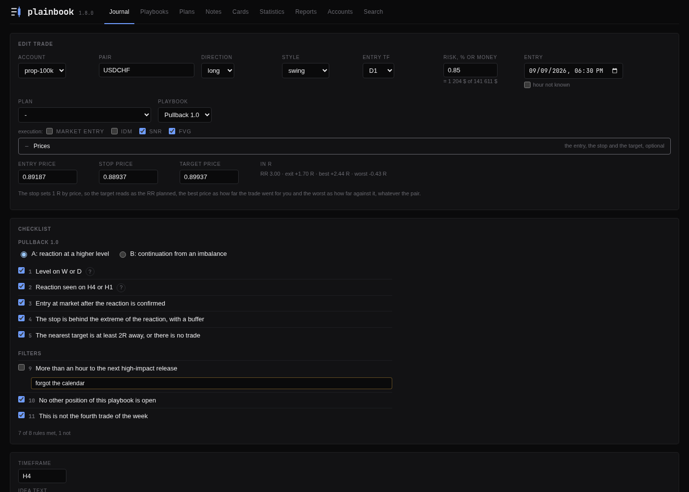

**+ Trade** opens the form. You pick the account, the pair, the direction, the
style and the entry timeframe, and write the risk as a percent of the balance
or as a sum of money; the line under the field converts one into the other
against the balance the account has at that moment. If the trade follows a
plan, you pick the plan; if it is taken under a playbook, you pick the
playbook, and its rules appear as a checklist with a box each. The entry, the
stop and the target price can go in too, and the form says the RR of the
trade while you type. Then the idea: one block per timeframe, a few words and
the screenshots, pasted with Ctrl+V from TradingView, MetaTrader or a screen
capture, or dragged in as files.

The idea gets written down before the market says who was right. In
hindsight an idea always looks tidier than it was, which is the reason the
journal asks for it first.

The same position taken on two accounts is filled in once: a block at the
bottom of the form puts a copy on every other account you tick, each with a
risk of its own. While the position runs, **Update** on its page adds a dated
line with a screenshot, and **Breakeven** says the stop now stands at the
entry, so the trade can no longer lose what it was sized for and the daily
loss limit stops counting it.

## Closing a trade

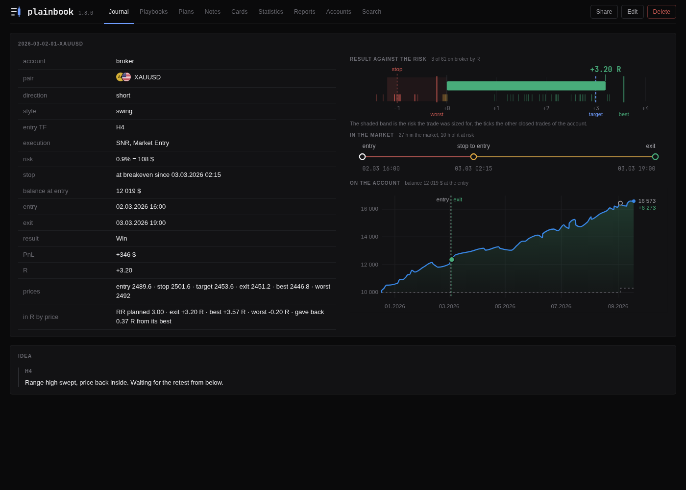

**Close trade** asks for the result, the PnL and the moment of the exit, then
the exit screenshot and your conclusions, and, if you keep them, the exit
price and the best and worst price the market reached while the trade was
open. If the trade was opened under a playbook, the rules of holding the
position are ticked here, the same way the entry rules were ticked at the
open. R is worked out on the spot from the PnL, the risk and the balance the
account had at the entry.

Beside the fields every trade carries a **passport**: its result on an axis
of R against the risk it was sized for, with the target, the best price (MFE)
and the worst price (MAE) marked and the other trades of the account as
ticks; its time in the market, with the stretch at risk and the stretch
after the stop went to the entry; and the equity curve of its account with
the entry and the exit on it.

The page of a closed trade shows every field, the idea with its screenshots,
the updates, the exit and the conclusions, and both checklists with a tick or
a cross on every rule, in the version of the playbook the trade was ticked
against. Edit changes any of it later, screenshots included; Delete moves the
trade to a trash folder, from where the Accounts tab can restore it.

## A playbook: the trading system at every trade

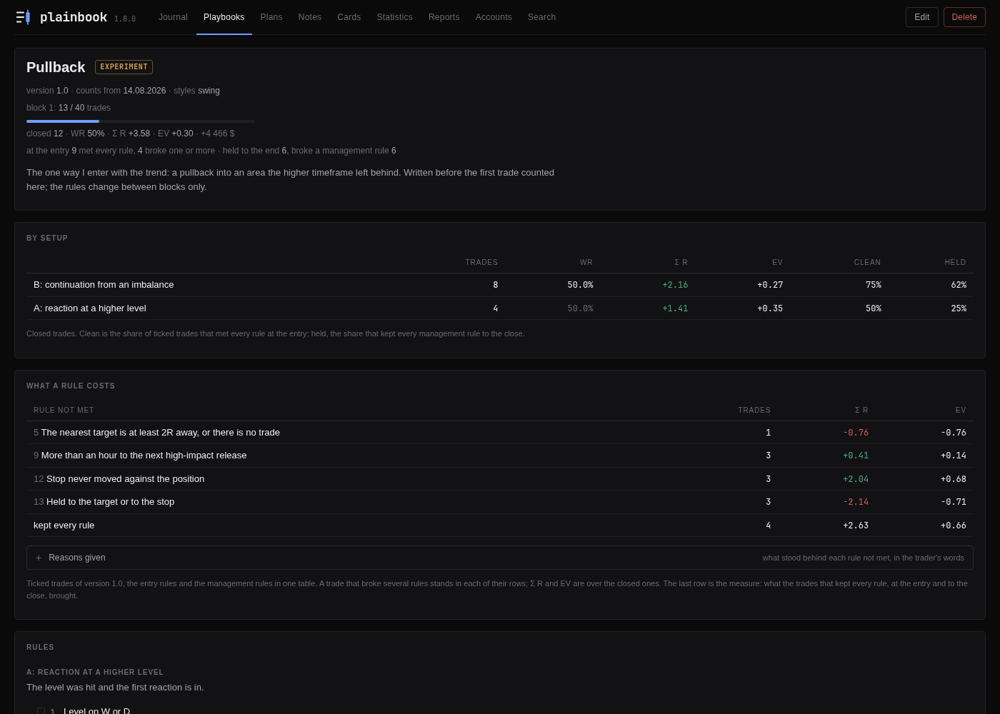

A playbook is one way of trading written down as rules: the setups with their
conditions, the filters checked before every trade, the rules of holding the
position, the limits. It is the system itself, and it stands in the trade
form: a trade is opened under a playbook and its rules are ticked there, a
box each and a line for why when a box stays empty. The management rules are
ticked at the close. The journal refuses nothing; a broken rule is recorded
with the trade, along with the reason.

That is what makes the figures on the playbook's page possible. **By setup**
says which way of entering earns and which loses. **What a rule costs** lists
every rule that was not met, how many trades broke it and what those trades
brought in R, against the trades that kept every rule. An edge that has been
ticked against every trade is a figure, and the place in the process where
the most is lost shows on its own, because the rules and the results were
collected as the trades were written.

Rules change by version. Once a trade has been ticked against a version, a
change of the rules asks for a new number, the old rules are kept, and every
trade keeps the rules it was ticked against. A playbook reviewed by blocks
of trades asks for its review when a block is complete. [PLAYBOOK.md](PLAYBOOK.md)
takes the form apart, field by field.

## A plan before the trade

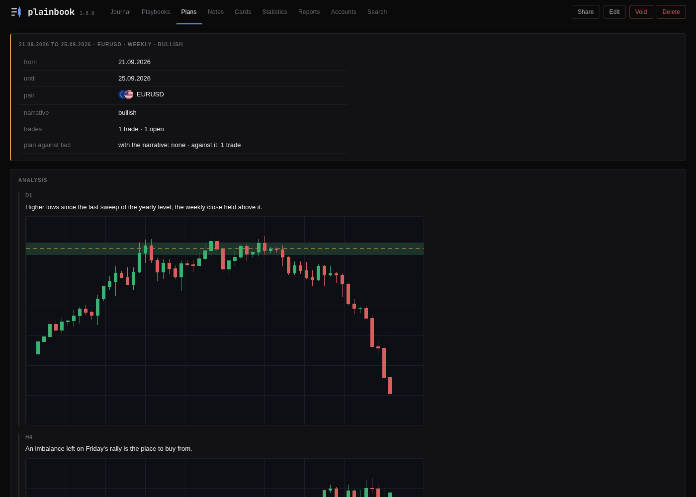

A trading plan is a record of its own, written before the market opens: the
pair, the narrative, the analysis by timeframe with its screenshots, what you
will do and what you will not. Updates are added while it runs, each with its
date and its own screenshots, and a review is written after. A plan the market
went against is voided rather than deleted, with the reason kept.

A trade points at the plan it followed, so the plan's page lists every trade
that came out of it with its R, says how many went with the narrative and how
many against it, and answers the one question worth asking of a plan: whether
following it was worth anything.

## Notes about the market

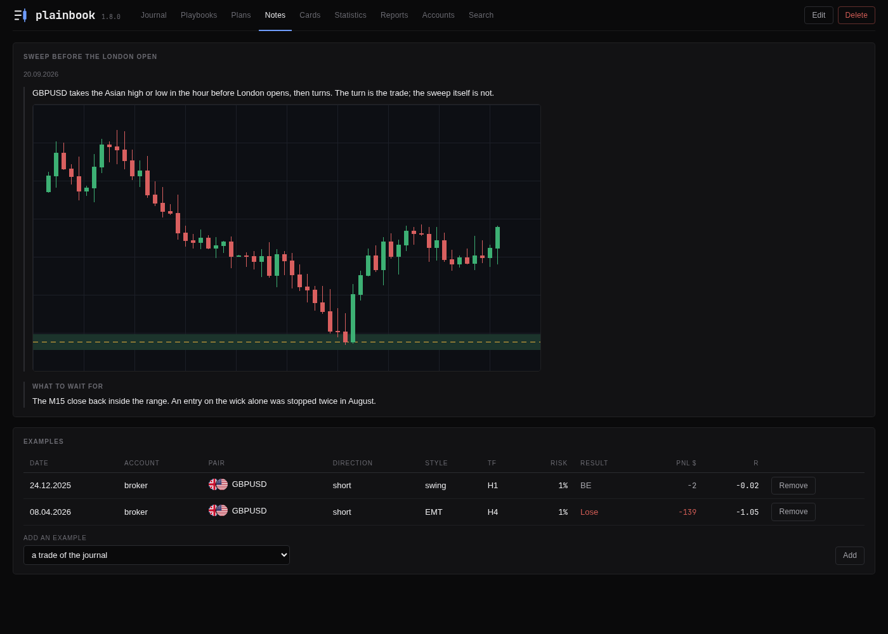

A note is for what is wider than one trade: a level a pair keeps respecting, a
pattern that comes back, a lesson. It holds text and screenshots in blocks,
and the trades of the journal can be tied to it as examples, so the note is
read next to the trades that show it, each a click away.

## The daily and weekly cards

<p align="center">
  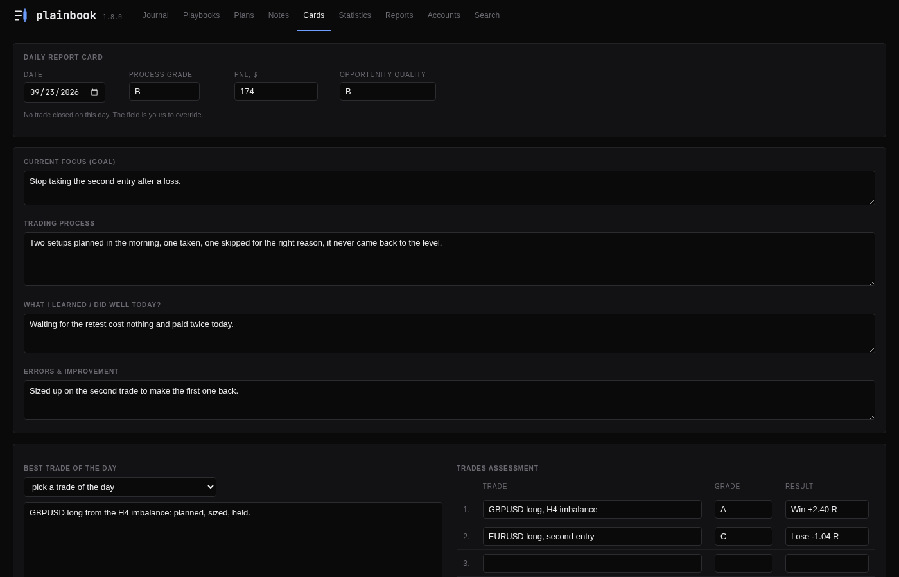
  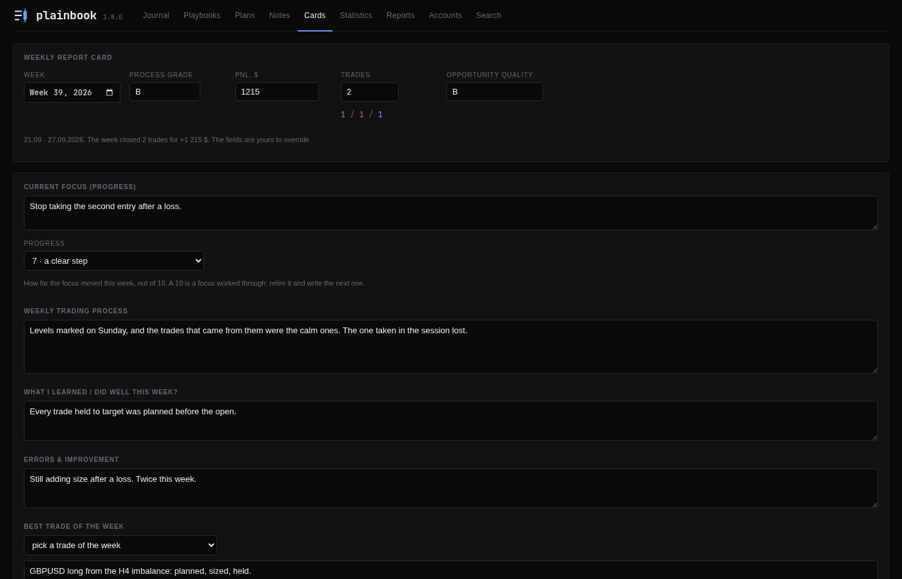
</p>

The day is reviewed on the pattern of a paper Daily Report Card: process
grade, opportunity quality, the focus you are working on, the trading
process, what went well, errors, the best trade, and a trades assessment
where every trade of the day gets its mark next to its result, the result
offered by the journal. The PnL of the day is filled in from the trades you
closed and stays yours to change. The weekly card does the same for a
trading week, with the progress on the focus and the key lesson of the week.
**+ DRC** and **+ WRC** in the header open them.

## Statistics

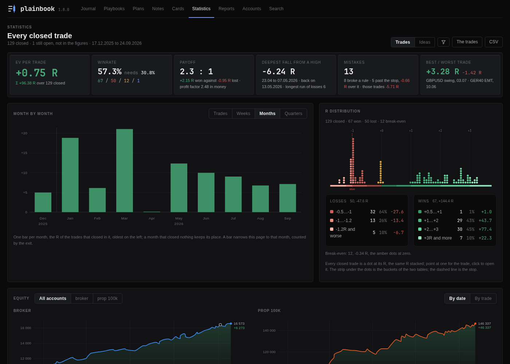

Cut the whole history any way you like, by account, pair, style, direction,
result or period, and the page opens on what that cut did. The strip leads
with the **EV** per trade (the expectancy, in R), then the **winrate** beside
the winrate the cut would need to break even, the **payoff** ratio, the
**deepest fall from a high** (the maximum drawdown) with the dates and the
longest losing streak, the **mistakes**, and the best and worst trade. The
payoff carries the **profit factor** in money, and with one account chosen
the drawdown is given in money and in percent as well. Every figure is read
against the trades the filter left out. A position copied onto two accounts
can be counted once, as one idea, so two accounts do not double a streak.

Under the strip every closed trade stands as one bar against the line of the
stop, or the weeks, months and quarters once there are too many trades to
tell apart. The R distribution puts every trade as a dot on one axis of R,
losses and wins counted by size underneath, with the losses cut where a stop
lands, so an overrun of the stop is its own bucket; point at a dot for the
trade and click it to open it. The equity curve is drawn per account, by
date or by trade, coloured against the balance it started from. The EV by the
weekday of entry says which days your trades earn on, and the **Prices** card
reads the prices you kept: the RR planned, how often the target was reached,
the average MFE and MAE, and what a winner gave back from its best. Then the playbooks with what each rule
cost, the stop at breakeven against the stop that stayed, and the tables by
period, pair, style, account, direction, entry timeframe, execution and time
in the market. A bar or a row narrows the page to itself; Back steps out one
click at a time.

## Reports

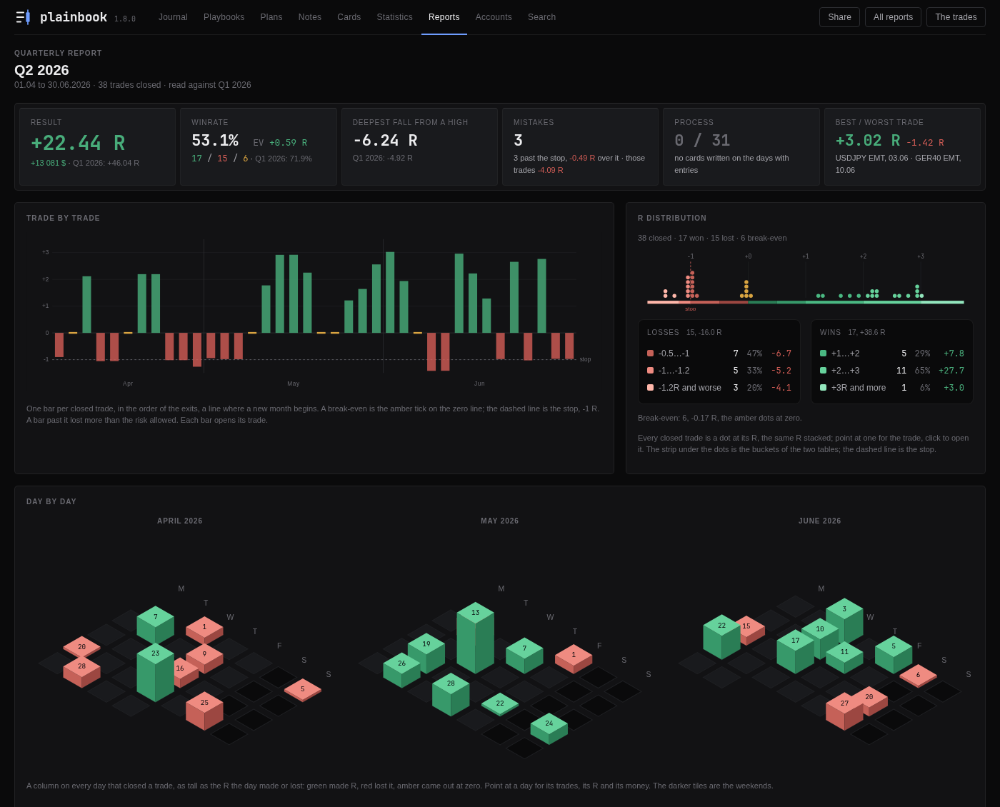

A month or a quarter opens on its figures, one tile each, with the period
before in grey under them: the result, the winrate with the EV, the deepest
fall from a high, the mistakes, the cards written against the days traded,
the best and the worst trade. Under them every closed trade of the period as
one bar, the R distribution, **day by day** (the month as a calendar on
its back, a column on every day as tall as the R it made or lost), which
rules were not met and what they cost, the errors you wrote on your cards,
and your conclusions, which are kept through every rebuild. A pair, a style,
an account or a direction in the tables leads back to the trades it was
counted from.

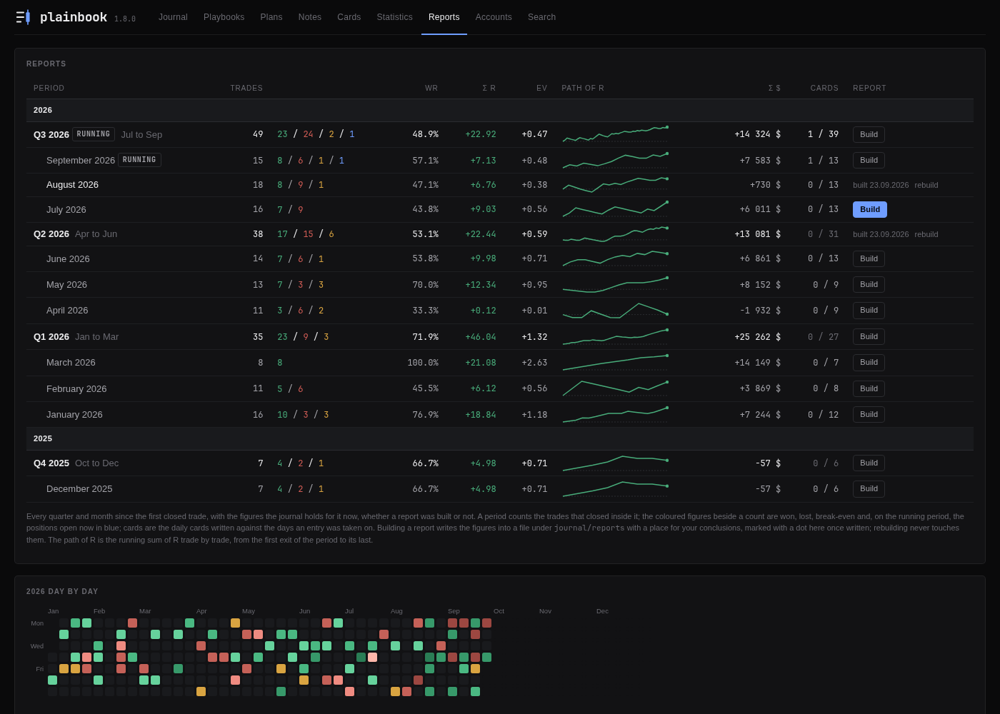

The Reports tab is a shelf of every month and quarter since the first closed
trade, with its figures and the path its R took, whether a report was built
for it or not. Under the shelf stands every year day by day, a square a day,
green for a day that made R and red for one that lost it.

## Prop firm accounts and their rules

An account is a broker account or a prop account. A prop account holds the
rules of its firm, and the journal keeps it against them:

- the **daily loss limit**, counted on the firm's own day and clock
  (midnight in Prague, five in the afternoon in New York, or whatever the
  firm uses), with the fees of the day and the risk still open at the stops;
- the **max loss**, static from the start balance, trailing under the
  highest balance, or trailing until the floor reaches the start;
- the **profit target** and the **minimum trading days**.

Every firm writes its own rules, and a challenge, a verification and a
funded account often differ, so the journal ships with none of them: you
copy yours from the firm's page, as money or as a percent of the start
balance. The row of the account then says how much of the day is spent, how
far the balance stands above the floor now and at the stops of the open
trades, how much of the target is made and how many trading days are done,
in amber near a limit and in red once one is reached.

## Accounts and money

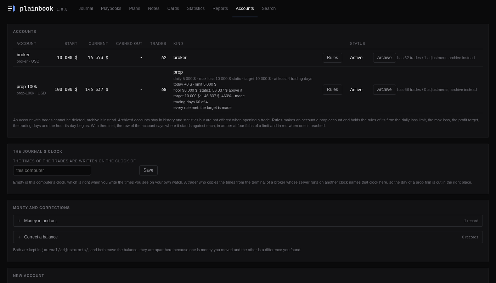

Accounts are created with a name, a start balance and a currency, and each
sum in the journal carries the sign of its account.

Deposits, withdrawals and fees are written down here, apart from trading, so
a payout is never mistaken for a loss, each with its date and, when you know
it, its hour. When the broker shows a different
balance, you type the real number and the journal records the difference as
a correction with your comment; history is never edited to make a figure
agree. The tab also holds the words the trade form offers, the trading
styles, the entry timeframes, the execution formats and the pairs, all of
them lists you edit, and the trash, where every deleted record waits with a
Restore button.

## Showing a trade to another trader

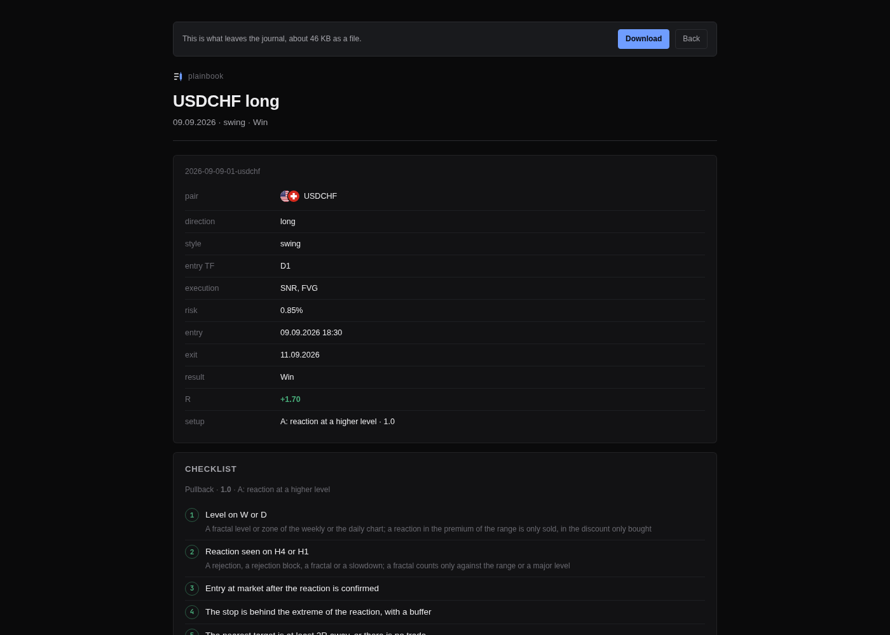

**Share** on a trade, on a plan, over the filtered list or on a report writes
one HTML file with the screenshots carried inside it. It opens on any
machine, offline, with no journal running, and prints to a PDF that reads
like the journal. No money travels in it: the PnL, the risk in money, the
balances, the size and even the name of the account stay home. What travels
is R, the percent the risk was written as, and the words you wrote. You see
the document, and what it will weigh, before you send it.

## Search

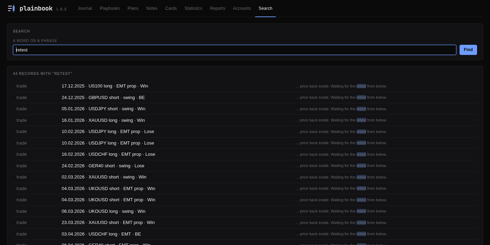

A word or a phrase is looked for in everything you have written: ideas,
conclusions, updates, plans, notes, playbooks and cards. Every hit is a link
to the record, with the matching words shown in the text around them. It is
the way to find the trade where you wrote "moved the stop too early" three
months ago.

## Install

There are four ways in, and the same journal behind each. Pick the one that
matches what is on the machine.

**1. A file to download.** The [releases page](https://github.com/stop-loss-enjoyer/plainbook/releases/latest)
carries one file per system: `Plainbook-<version>-windows.exe`,
`Plainbook-<version>-macos-arm64.zip` (Apple silicon, unzip it first),
`Plainbook-<version>-macos-x86_64.zip` (a Mac with an Intel processor) and
`Plainbook-<version>-linux-x86_64` (run `chmod +x` on it once). Inside is
this same source, unchanged, packed together with a Python interpreter, so
no Python is needed on the machine. Run it: a small window says where the
journal is, and the journal opens in the browser, as a window of its own
when Chrome, Chromium, Edge or Brave is installed and as a tab otherwise.
Closing the small window stops the journal. The records go to a `Plainbook`
folder in your home folder, and removing the program is deleting the file.
On the first run Windows shows a SmartScreen page (*More info*, then *Run
anyway*) and macOS refuses to open the file until *Privacy & Security*,
*Open Anyway*; both are about a paid signing certificate the project does
not have. [Checking a downloaded file](#checking-a-downloaded-file) says how
to know that the file is what it claims to be.

**2. With an agent.** Download the source: on the releases page, under
*Assets*, *Source code (zip)*, or the green *Code* button at the top of this
page, *Download ZIP*. Unzip it where you keep your projects, open the agent
(Claude Code or another) in that folder and say: *read INSTALL.md and set the
journal up on this machine*. [INSTALL.md](INSTALL.md) is written for it: it
settles with you where the records live, sets up the autostart and checks the
result together with you.

**3. pipx.** For a machine that already has Python and
[pipx](https://pipx.pypa.io/):

```bash
pipx install git+https://github.com/stop-loss-enjoyer/plainbook
plainbook
```

The `plainbook` command starts the journal and opens the browser on it, with
the records in `~/Plainbook`. `pipx upgrade plainbook-journal` brings the next
version.

**4. From the source, by hand.** Python 3.10 or newer, nothing to install:

```bash
git clone https://github.com/stop-loss-enjoyer/plainbook.git
cd plainbook
python3 -m plainbook.server
```

Open <http://localhost:8778>. Here the records live in the project folder,
next to the code.

Whichever way in, go to **Accounts** and create one: a name and the balance
the account has today. The start balance is the point the journal counts
from, so the computed balance is right from the first minute.

`PLAINBOOK_PORT` changes the port (8778 by default), `PLAINBOOK_ROOT` changes
where the records live, and `PLAINBOOK_OPEN=0` keeps a start from opening a
browser, for a service. Autostart on Linux, Windows and macOS, and the
desktop samples in `desktop/`, are described in [INSTALL.md](INSTALL.md).

### Checking a downloaded file

The files are built by GitHub from the tag of the release, on its own
machines, by a recipe that sits in the repository
([release.yml](.github/workflows/release.yml)); the log of every build is
public on the [Actions](https://github.com/stop-loss-enjoyer/plainbook/actions/workflows/release.yml)
tab. Each file is attested: GitHub signs a statement that this exact file
came out of that workflow, from that commit. With the
[GitHub CLI](https://cli.github.com/):

```bash
gh attestation verify Plainbook-<version>-windows.exe --owner stop-loss-enjoyer
```

A file altered after the build, or built anywhere else, fails that check.
Antivirus software now and then flags a file made by PyInstaller as
suspicious, because malware has used the same packer; the public build and
the attestation are the answer to that until the project pays for a
signature. If that is still not enough, the other three ways in run the
source itself.

## Your data

A trade is a folder: one markdown file and its pictures. The file reads like
this:

```markdown
---
id: 2026-08-29-01-eurusd
account: broker
pair: EURUSD
direction: long
style: swing
entry tf: H4
execution:
  - Market Entry
risk %: 1
entry: 2026-08-29 14:30
entry price: 1.0842
stop price: 1.0822
target price: 1.0892
playbook: pullback
playbook version: 1.0
setup: B: continuation from an imbalance
deviations:
result: Win
pnl $: 174
exit: 2026-08-31 16:00
exit price: 1.0877
best price: 1.0889
worst price: 1.0836
---

## Idea

### H4

Range breakout, waiting for a retest.


## Exit


## Conclusions

Held to target, did not move the stop.
```

An empty `deviations:` key means the rules were ticked and every one was
met; a missing key means they were never ticked. Keep that difference if you
edit a file by hand. The prices are optional, and so is every other key a
trade does not need. The rest of the layout:

```
journal/
  accounts/<id>.md          start balance, currency, kind, the rules of a prop firm
  adjustments/<id>.md       deposit, withdrawal, fee, reconciliation
  trades/<id>/              trade.md and shots/
  plans/<id>/               plan.md and shots/
  playbooks/<id>/           playbook.md, versions/<number>.md, shots/ of the reviews
  notes/<id>/               note.md and shots/
  cards/YYYY-MM-DD.md       the daily card
  cards/YYYY-Www.md         the weekly card, in the same folder
  reports/2026-08.md        a monthly report, 2026-Q3.md a quarterly one
  vocabulary.md             the styles, timeframes and execution formats the form offers
  pairs.md                  the pairs the form offers
  settings.md               the stop edge, the journal's clock
.trash/                     next to journal/: deleted records, until you restore or remove them
.drafts/                    next to journal/: screenshots of unsubmitted forms, swept daily
```

That is the whole storage format. There is no database and no export button,
because the export is a copy of the folder. Put the folder under git and
`git log` gives you the history of your own thinking, and a way back if you
fix a number you should not have. Once the code itself is under git, keep the
records apart from the program:

```bash
PLAINBOOK_ROOT=~/plainbook-data python3 -m plainbook.server
```

Then the program can live in a public repository while the records sit in a
private one that is never pushed anywhere. Old trades from a spreadsheet, a
Notion export or another journal are brought in by `tools/import_csv.py`,
which writes them the way the interface does.

## How the numbers work

**Balance** = start balance + Σ PnL of closed trades + Σ adjustments. It is
never written to a file, so there is no stored copy to go stale.

**R** = PnL / (risk% × the account balance at the moment of entry). The
balance at entry is what the account held when the trade was opened, with
every trade closed before that moment already in it, so 1% of risk stops
looking like the same amount of money forever.

**Winrate** = wins / (wins + losses). Break-even trades stay out of the
denominator, because a trade that ended at zero was neither won nor lost. A
winrate worked out from fewer than five decided trades stands in grey,
because a percentage of two trades is not a rate.

**R by price** = (exit - entry) / (entry - stop) for a long, the other way
round for a short. The stop sets 1 R by price, so the target is the RR
planned, the best price the MFE and the worst the MAE, whatever the pair.

**Profit factor** = the money of the winning trades / the money of the losing
ones, fees and sizes included; the payoff says the same in R.

**EV** = Σ R / closed trades: the expectancy, what a trade brought on average,
in R. Unlike the winrate, it counts the break-evens: a trade closed at zero
still paid its commission and never comes back at exactly zero R. It stands
to the right of every winrate on the front page, and is a column of every
table on the Statistics tab and in the reports.

**A period is what closed in it.** A report, the current-period tile on the
front page and the cards count the trades that closed in the period, the way
a broker states a month. The list of trades groups by entry, because a
journal is read by the decisions in it.

**Total R instead of a total in dollars.** With more than one account, a
dollar on a prop account and a dollar on your own are different kinds of
money, so the front page adds up R across accounts and leaves the money per
account.

## Built to be kept by an agent

Most software tolerates a coding agent. This one is arranged for it, and the
arrangement is the same one that makes the journal private and durable: plain
files, no dependencies, a small surface. There is no package manager, no
lockfile and no build step, so an agent that can run `python3` can run the
whole project. The tests, more than three hundred of them with no fixtures
and no network, finish in a few seconds. [AGENTS.md](AGENTS.md) holds the map of
the code, the invariants that must not be broken, recipes for the usual tasks,
and the traps that have already bitten this project, each with the reason it
exists. A guard, `tools/check_public.py`, refuses a push that would carry
trade records or anything else it recognises as yours; it runs as a pre-push
hook and in CI. The whole program is about 15 000 lines of Python, so it fits
in a context window and an agent reasons about the real thing.

`CLAUDE.md` points at the same guide, so Claude Code picks it up unprompted;
Codex, Cursor and the other agents read `AGENTS.md` on their own.

## FAQ

**Is Plainbook free?** Yes. There is no plan, no trial and no account. The
licence is PolyForm Noncommercial: run it, change it, pass it on, as long as
nobody sells it.

**Is it open source?** The whole source is in this repository, to read,
change and share. The licence is PolyForm Noncommercial rather than an OSI
one, because it forbids selling the journal or building it into a product
that is sold; if that is what open source means to you, this is not it.

**Is it a replacement for TradeZella, Edgewonk or TraderSync?** For keeping
and reading a journal, yes: trades with screenshots, playbooks with their
checklist, plans, notes, daily and weekly cards, R-multiple statistics, MFE
and MAE, prop firm rules, monthly and quarterly reports. What it lacks is
what those have by being online: broker sync and, for most of them, a
mobile app.

**Does it track prop firm rules, for FTMO or another firm?** Yes, for any
firm: a prop account holds the daily loss limit, the max loss (static or
trailing), the profit target, the minimum trading days and the hour and
time zone of the firm's day, typed from your firm's own rules. The journal
says where the account stands against each.

**Does it track MFE and MAE?** Yes, when you write the prices: with the entry
and the stop on a trade, the best and the worst price it reached read as MFE
and MAE in R, and the Statistics tab averages them with the RR planned and
what the winners gave back.

**Does it need the internet?** No. It runs on your machine, reads and writes
a folder, and makes no network request at all. The server binds `127.0.0.1`,
refuses requests under a host name or from an origin that is not its own,
and has no authentication, so
it is for your own machine and should never be put behind a public address.

**Does it connect to my broker or to MetaTrader?** No, on purpose. Trades are
typed in, because writing the idea down is the part that makes a journal
worth keeping. Screenshots come from wherever you take them.

**Is it for forex only?** No. A pair is free text, so stocks, futures,
indices, metals and crypto tickers all work, and the words in the form are
lists you edit.

**Windows, macOS or Linux?** All three: a file per system on the releases
page, or the source on any Python 3.10 or newer. There is no mobile app; it
is a page on localhost.

**Can I bring in the trades I already have?** Yes, with `tools/import_csv.py`
from a CSV table; [INSTALL.md](INSTALL.md) walks an agent through it.

**Can a coding agent install and run it?** Yes: Claude Code, Codex, Cursor or
another agent, opened in the folder and told to read [INSTALL.md](INSTALL.md).
[AGENTS.md](AGENTS.md) is what it reads before changing anything.

**Can I edit the files by hand?** Yes, that is the point. Keep the header
keys intact; everything else is ordinary markdown. A file that stops reading
is named at the top of every page with the reason, and everything else keeps
working without it.

**How do I back it up?** Copy the `journal/` folder, or keep it under git and
push it to a private repository of your own.

**Why plain files and no database?** Because text files outlive the program
that wrote them, and a database would stand between you and your records.

**Where does the name come from?** Plain text, plainly kept: a book of trades
in files that you, an editor, a script or an agent can read without asking
permission.

## The documents

- [GUIDE.md](GUIDE.md): the day-to-day manual, every tab and every form.
- [INSTALL.md](INSTALL.md): installing, autostart on Linux, Windows and
  macOS, desktop integration, bringing old trades in.
- [PLAYBOOK.md](PLAYBOOK.md): writing a playbook, part by part.
- [FEATURES.md](FEATURES.md): what is already here, tab by tab, and which
  requests it answers.
- [CHANGELOG.md](CHANGELOG.md): what changed in every version.
- [CONTRIBUTING.md](CONTRIBUTING.md) for people and [AGENTS.md](AGENTS.md)
  for agents. Bug reports and small, focused pull requests are welcome; keep
  it dependency-free, run `python3 -m unittest discover -s tests`, and
  remember that somebody's trading history is on the other end of this code.

## Licence

PolyForm Noncommercial 1.0.0, from version 1.5.1 on. See [LICENSE](LICENSE).
You can run the journal, change it for yourself and pass it on, for any
purpose that is not commercial. Selling it, selling it under another name, or
building it into a product that is sold is not allowed. Every version up to
1.5.0 was released under MIT, and that is not withdrawn from them.

Required Notice: Copyright 2026 stop-loss-enjoyer
